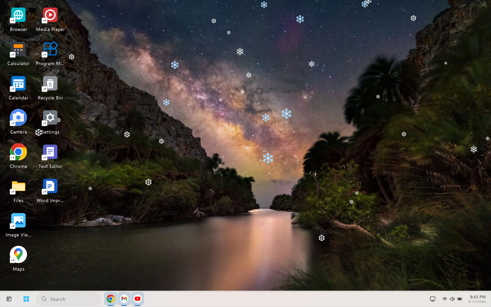
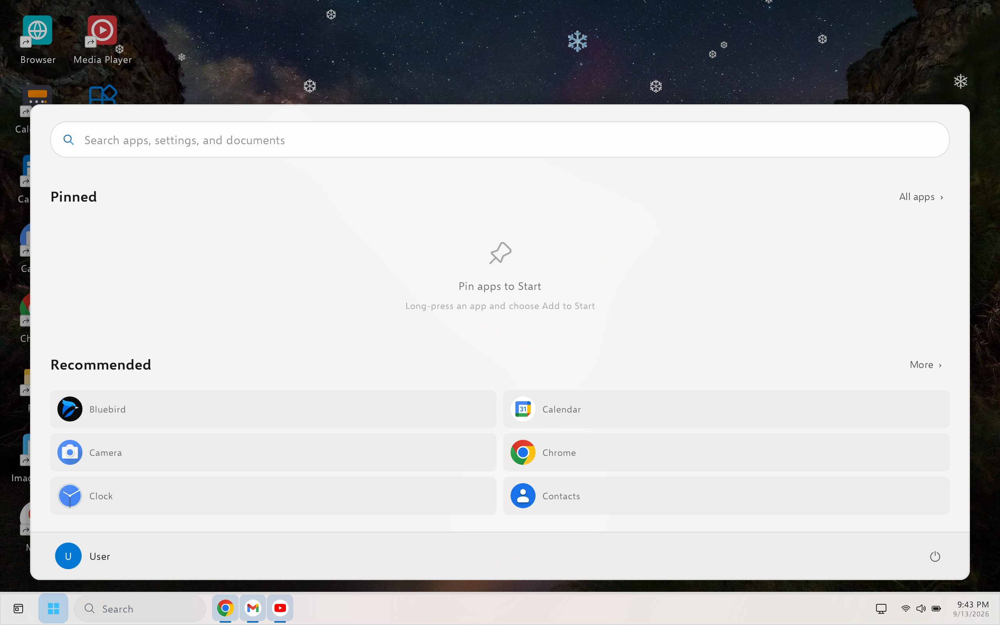
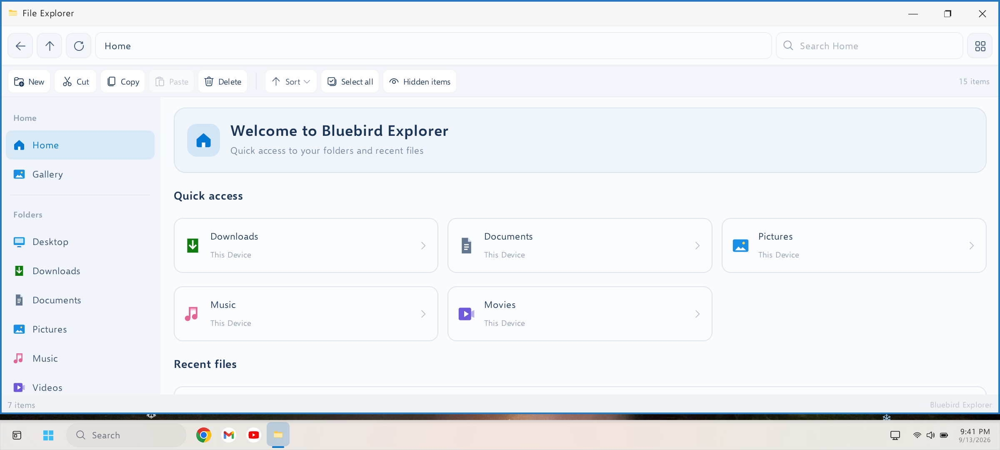
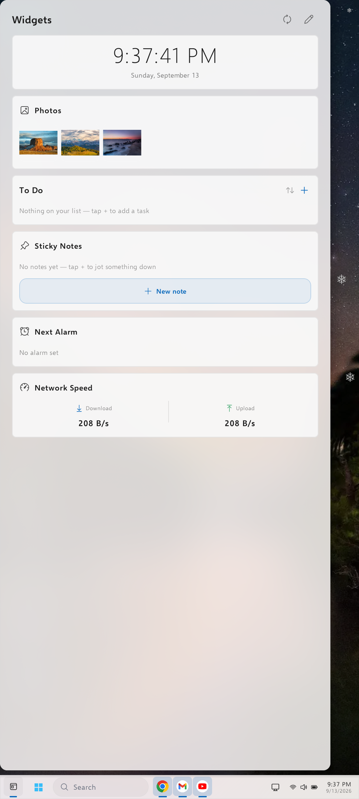
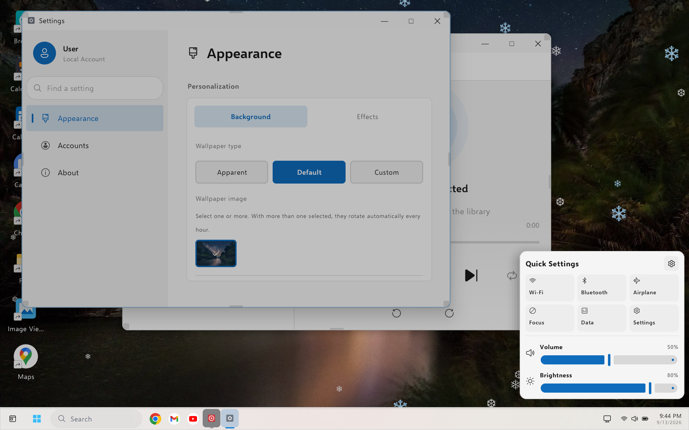

# Bluebird

Bluebird is a desktop-styled Android launcher that turns your phone into a compact desktop experience with a taskbar, floating windows, a start-menu style app list, and a small built-in app suite.

## Latest release

- Version: v2.2
- Android: 8.0+
- Requires no root

Download counts for v2.2 are provided by GitHub on the release asset.

## Screenshots

## Repo contents

- `index.html` — landing page and release site
- `assets/apks/` — downloadable APK builds
- `assets/img/screenshots/` — app screenshots
- `assets/js/` — site scripts

## Quick start

1. Download the latest APK above.
2. Install it on an Android device.
3. Set Bluebird as your default launcher.

This repo keeps the release site and APK builds together for simple access to the latest version.
